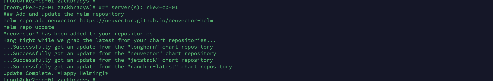

# test123


# Fácil instalación de RKE2, Rancher Manager, Longhorn y Neuvector

### Tabla de contenidos

- [Acerca de mí](#Acerca-de-mí)
- [Introducción](#Introducción)
- [Observa el video](#Observa-el-video)
- [Infrastructura](#Infrastructura)
- [Rancher Kubernetes (RKE2)](#rancher-kubernetes-rke2)
- [Rancher Multi Cluster Manager](#rancher-multi-cluster-manager)
- [Rancher Longhorn](#rancher-longhorn)
- [Rancher NeuVector](#rancher-neuvector)
- [Conclusión](#Conclusión)

## Acerca de mí

Un poco de mi historia...

- Solution Architect para SUSE Mexico
- He trabajado en el area de preventa por más de 8 años
- Conocimiento en el area de on-premise, nube y ahora nube nativa
- Gamer de nacimiento, me encanta jugar muchos juegos de los 90s!

## Introducción

### Bienvenido a la Guía de Fácil instalación de Rancher.

En esta guía de despliegue, instalaremos todo el stack de SUSE Rancher, que incluye los siguientes productos:

- RKE2 (Distribución de Kubernetes) - [Click aquí para conocer más](https://ranchergovernment.com/products/rke2)
- Rancher Manager (Administración de Clústeres) - [Click aquí para conocer más](https://ranchergovernment.com/products/mcm)
- Longhorn (Almacenamiento) - [Click aquí para conocer más](https://www.ranchergovernment.com/products/longhorn)
- Neuvector (Seguridad) - [Click aquí para conocer más](https://ranchergovernment.com/neuvector)

### Prerequisitos

- Tres (3) servidores Linux con acceso a internet
- Herramientas para administrar los servidores (Terminal, VSCode, Termius etc...)

## Observa el video

Si prefieres seguir esta guía con un increíble video... por favor, haz clic a continuación. (https://www.youtube.com/watch?v=47ZcCMgKNWw)!

[]()

## Infraestructura

Para este despliegue, necesitamos tres servidores Linux para poder poner todo en marcha. Estaremos utilizando tres servidores OpenSUSE Leap 15.5 virtualizados, aprovisionados por VirtualBox. Cualquier distribución de Linux debería funcionar perfectamente, siempre que haya conectividad de red. Aquí tienes una lista de nuestros [Sistemas Operativos soportados](https://docs.rke2.io/install/requirements#operating-systems). Para configurar estos servidores para Rancher, necesitaremos que estén conectados a internet y sean accesibles desde tu computadora a través de `ssh`.

Aquí tienes una visión general de la arquitectura que utilizaremos para esta guía de despliegue:


Ejecutemos los siguientes comandos en cada uno de los nodos para asegurar que tengan los paquetes y configuraciones necesarias.

```bash
# server(s): rke2-cp-01, rke2-wk-01, and rke2-wk-02
# Instalar los paquetes
zypper --non-interactive install -n open-iscsi && systemctl enable iscsid && systemctl start iscsid

# Deshabilitar el Firewall
systemctl stop firewalld && systemctl disable firewalld
```

## Rancher Kubernetes (RKE2)

Para configurar e instalar RKE2, es necesario tener nodos de "control" y nodos de "worker". Comenzaremos configurando el nodo Control y luego configurando los nodos Worker. Hay muchas maneras de lograr esto y esta guía está diseñada para una instalación mínima y de manera fácil. Revise los [documentos de rke2] (https://docs.rke2.io) para obtener más información.

### RKE2 Nodo de Control

Comencemos configurando el nodo de Control RKE2, agregando un archivo de configuración. Dado que estamos realizando una instalación sencilla, utilizaremos la opción de configuración por token para RKE2. Estoy en una sesión `ssh` con `root` para acceder al servidor `rke2-cp-01`.

Si deseas ver más formas de configurar el nodo de Control de RKE2, consulte los [documentos del servidor rke2] (https://docs.rke2.io/reference/server_config).

```bash
# server(s): rke2-cp-01
# Crear el directorio RKE2
mkdir -p /etc/rancher/rke2/

# Crea el archivo de configuración RKE2
cat << EOF >> /etc/rancher/rke2/config.yaml
token: rke2SecurePassword
EOF
```

Ahora que el archivo de configuración está completo, instalemos e iniciemos el nodo de Control de RKE2:

```bash
# server(s): rke2-cp-01
# Descarga la distribucion de RKE2 e instala en modo Control
curl -sfL https://get.rke2.io | INSTALL_RKE2_CHANNEL=v1.30 INSTALL_RKE2_TYPE=server sh -

# Inicie el servicio de Control de RKE2
systemctl enable rke2-server.service && systemctl start rke2-server.service
```

Verifiquemos que el nodo de Control se esté ejecutando usando `systemctl status rke2-server`. Debería verse así:


Ahora que vemos que el nodo de Control se está ejecutando con RKE2, verifiquemos usando `kubectl`.

```bash
# server(s): rke2-cp-01
# Enlace simbólico para kubectl y containerd
sudo ln -s /var/lib/rancher/rke2/data/v1*/bin/kubectl /usr/bin/kubectl
sudo ln -s /var/run/k3s/containerd/containerd.sock /var/run/containerd/containerd.sock

# Actualizar BASHRC
cat << EOF >> ~/.bashrc
export PATH=$PATH:/var/lib/rancher/rke2/bin:/usr/local/bin/
export KUBECONFIG=/etc/rancher/rke2/rke2.yaml
export CRI_CONFIG_FILE=/var/lib/rancher/rke2/agent/etc/crictl.yaml
alias k=kubectl
EOF

# Source BASHRC
source ~/.bashrc

# Verifique que RKE2 esté funcionando/listo
kubectl get nodes
```

Debería verse así:


### RKE2 Nodos Worker

Ahora comencemos configurando los nodos de Worker RKE2 agregando el archivo de configuración. Dado que estamos realizando una instalación sencilla,  utilizaremos la opción de configuración por token para RKE2 y la configuración de Worker. Estoy en una sesión de `ssh` con `root` para acceder a los servidores `rke2-wk-01` y `rke2-wk-02`.

Si desea ver más formas de configurar el nodo worker de RKE2, consulte los [documentos del agente rke2] (https://docs.rke2.io/reference/linux_agent_config).

_Nota: Debe completar cada uno de estos pasos en cada nodo de Worker, además modifique la dirección IP del nodo de Control según sea la que estes utilizando._

```bash
# server(s): rke2-wk-01 and rke2-wk-02
# Crear el directorio RKE2
mkdir -p /etc/rancher/rke2/

# Cree el archivo de configuración RKE2
cat << EOF >> /etc/rancher/rke2/config.yaml
server: https://10.0.0.15:9345
token: rke2SecurePassword
EOF
```

Ahora que el archivo de configuración está completo, instalemos e iniciemos los nodos de Worker de RKE2:

```bash
# server(s): rke2-wk-01 and rke2-wk-02
# Descargar RKE2 e instalar en modo Worker
curl -sfL https://get.rke2.io | INSTALL_RKE2_CHANNEL=v1.30 INSTALL_RKE2_TYPE=agent sh -

# Inicie el servicio de Worker de RKE2
systemctl enable rke2-agent.service && systemctl start rke2-agent.service
```

Regresemos al servidor `rke2-cp-01` y verifiquemos que los nodos de Worker se unieron exitosamente al clúster.

```bash
# server(s): rke2-cp-01
# Verifica que RKE2 esté funcionando/listo
kubectl get nodes
```

Debería verse así:


Felicitaciones!! ¡Ya tiene su clúster RKE2 en funcionamiento! Si ya estás familiarizado con Kubernetes o RKE2, no dudes en explorar el clúster usando "kubectl". Ahora pasaremos a instalar [Rancher Multi Cluster Manager](https://www.ranchergovernment.com/products/mcm), [Rancher Longhorn](https://www.ranchergovernment.com/products/longhorn), y [Rancher NeuVector](https://ranchergovernment.com/neuvector).

## Rancher Multi Cluster Manager

Cuando la mayoría de las personas comienzan su viaje con Kubernetes y con Rancher Kubernetes, existe cierta confusión sobre las capas de Kubernetes. RKE2 es nuestra distribución de Kubernetes y Rancher Multi Cluster Manager es nuestro panel de control para administrar cualquier tipo de clúster de Kubernetes (incluidos cualquiera listados por la CNCF). Para ejecutar nuestro Rancher Manager, necesitábamos primero contar con un clúster de Kubernetes y es por eso que comenzamos con la instalación de RKE2.

¡Comencemos con la instalación de Rancher Manager! Para obtener los componentes necesarios para configurarlo e instalarlo, necesitamos usar [Helm CLI](https://helm.sh) como administrador de paquetes (charts) para k8s y luego instalar el chart [Cert Manager](https://cert-manager.io) y finalmente el chart de Rancher Manager. Usemos `ssh` con `root` para acceder al servidor `rke2-cp-01` y ejecutar los siguientes comandos:

```bash
# server(s): rke2-cp-01
# Descargar e instalar Helm
mkdir -p /opt/rancher/helm
cd /opt/rancher/helm

curl -fsSL -o get_helm.sh https://raw.githubusercontent.com/helm/helm/main/scripts/get-helm-3
chmod 755 get_helm.sh && ./get_helm.sh
mv /usr/local/bin/helm /usr/bin/helm
```

Ahora agreguemos los repositorios de Helm para Cert Manager y Rancher Manager:

```bash
# server(s): rke2-cp-01
# Agregar y actualizar los repositorios de Helm
helm repo add jetstack https://charts.jetstack.io
helm repo add rancher-stable https://releases.rancher.com/server-charts/stable
helm repo update
```

Debería verse así:


Ahora instalemos Cert Manager con los siguientes comandos:

```bash
# server(s): rke2-cp-01
# Crear el namespace de Cert Manager y después instalar Cert Manager
kubectl create namespace cert-manager

helm upgrade -i cert-manager jetstack/cert-manager --namespace cert-manager --set installCRDs=true

# Espere la implementación y el lanzamiento.
sleep 60

# Verificar el estado de Cert Manager
kubectl get pods --namespace cert-manager
```

Debería verse así:


Ahora instalemos Rancher Manager con los siguientes comandos (Notese el hostname que configuramos en los comandos, si lo deseas, puedes modificar este campo, así como el de password):

```bash
# server(s): rke2-cp-01
# Crear el namespace de Rancher y después instalar Rancher
kubectl create namespace cattle-system

helm upgrade -i rancher rancher-stable/rancher --namespace cattle-system --set bootstrapPassword=rancherSecurePassword --set hostname=rancher.10.0.0.15.sslip.io

# Espere la implementación y el lanzamiento.
sleep 45

# Verificar el estado de Rancher Manager
kubectl get pods --namespace cattle-system
```

Debería verse así:


### Explorando Rancher Manager

Una vez que todos los pods se muestren en estado `Running` (En ejecución) sobre el namespace de `cattle-system`, es posible puedes acceder a Rancher Manager! Dado que estamos usando `sslip.io` como nuestro nombre de host/DNS, no necesitamos configurar nada más para acceder a Rancher Manager. ¡Revisemos el hostname y echemos un vistazo al Rancher Manager!

Para esta implementación, se utilizó `https://rancher.10.0.0.15.sslip.io` para acceder a Rancher Manager, en tu caso, verifica cual fue el nombre de host que configuraste en el paso anterior.

Debería verse así:


Ahora debería visualizar Rancher Manager solicitando una contraseña que configuramos durante la instalación. Para mi implementación utilicé `rancherSecurePassword`. También deberás verificar la URL de Rancher Manager y aceptar los Términos y condiciones. Una vez completado... Debería verse así:


Ahora tienes Rancher Manager implementado con éxito en nuestro clúster RKE2 Kubernetes!!! Recuerda que hay muchas formas de configurarlo y esta fue solo una instalación mínima y sencilla. Siéntete libre de explorar todo lo que puedes hacer dentro de Rancher Manager, en este caso podemos pasaremos al siguiente paso de instalar Rancher Longhorn.

## Rancher Longhorn

Agreguemos el repositorio de Helm para Longhorn:

```bash
# server(s): rke2-cp-01
# Agregar y actualizar el repositorio de Helm
helm repo add longhorn https://charts.longhorn.io
helm repo update
```

Debería verse así:


Ahora instalemos Longhorn con los siguientes comandos (Recuerda revisar los comandos por si gustas modificar opciones como el hostname):

```bash
# server(s): rke2-cp-01
# Cree el namespace de Longhorn e instale Longhorn
kubectl create namespace longhorn-system

helm upgrade -i longhorn longhorn/longhorn --namespace longhorn-system --set ingress.enabled=true --set ingress.host=longhorn.10.0.0.15.sslip.io

# Espere la implementación y el lanzamiento.
sleep 60

# Verificar el estado de Longhorn
kubectl get pods --namespace longhorn-system
```

Debería verse así:


### Explorando Rancher Longhorn

Una vez que todos los pods se muestren como `Running` (En ejecución) en el espacio de nombres `longhorn-system`, es posible acceder Rancher Longhorn! Al igual que Rancher Manager, utilizamos `sslip.io`, por lo que no se requiere configuración adicional para acceder a Longhorn. Vayamos al nombre de dominio.

Para esta implementación, se utilizó `https://longhorn.10.0.0.15.sslip.io` para acceder a Rancher Longhorn.

Debería verse así:


¡Ahora tienes Rancher Longhorn implementado con éxito en nuestro clúster RKE2 con Rancher Manager! Siéntete libre de explorar el panel de Longhorn y ver lo fácil que es administrar los volúmenes, realizar copias de seguridad en un Bucket de S3 o configurar recuperación de desastres entre clústeres. Por lo pronto, pasemos a instalar Rancher NeuVector.

## Rancher NeuVector

¡Agreguemos el repositorio Helm para NeuVector!

```bash
# server(s): rke2-cp-01
# Agregar y actualizar el repositorio de Helm
helm repo add neuvector https://neuvector.github.io/neuvector-helm
helm repo update
```

Debería verse así:



Ahora instalemos NeuVector con los siguientes comandos (Recuerda revisar los comandos por si gustas modificar opciones como el hostname:

```bash
# server(s): rke2-cp-01
# Crea el namespace de NeuVector e instale NeuVector
kubectl create namespace cattle-neuvector-system

helm upgrade -i neuvector neuvector/core --namespace cattle-neuvector-system --set k3s.enabled=true --set manager.ingress.enabled=true --set manager.svc.type=ClusterIP --set controller.pvc.enabled=true --set manager.ingress.host=neuvector.10.0.0.15.sslip.io --set global.cattle.url=https://rancher.10.0.0.15.sslip.io --set controller.ranchersso.enabled=true --set rbac=true

# Espere la implementación y el lanzamiento
sleep 60

# Verificar el estado de Neuvector
kubectl get pods --namespace cattle-neuvector-system
```

Debería verse así:


### Explorando Rancher NeuVector

Una vez que todos los pods se muestren en estado `Running` (En ejecución) en el namespace de "cattle-neuvector-system", podrás acceder a NeuVector. Al igual que Rancher Manager y Rancher Longhorn, utilizamos `sslip.io`, por lo que no se requiere configuración adicional para acceder a NeuVector. Vayamos al nombre de dominio.

Para esta implementación, se utilizó `https://neuvector.10.0.0.15.sslip.io` para acceder a Neuvector.

Debería verse así:


Ahora deberías visualizar a NeuVector solicitando el nombre de usuario y la contraseña predeterminados. El nombre de usuario predeterminado es "admin" y la contraseña predeterminada es "admin".

Debería verse así:


¡Ahora tiene Rancher NeuVector implementado en nuestro clúster RKE2 con Rancher Manager y Rancher Longhorn! Siéntete libre de explorar NeuVector y ejecutar análisis de vulnerabilidades, investigar los componentes del clúster o comprobar la actividad de tu red de k8s. Aquí es donde normalmente recomendaríamos a los usuarios que intenten crear un nuevo clúster o implementar algunas aplicaciones de prueba para ver el verdadero poder detrás de Rancher. Por ahora, vamos a pasar a nuestra Conclusión...

## Conclusión

En unos sencillos pasos y un par de minutos, pudimos implementar todo el stack de Rancher y está listo para usar. Me parece que la forma que instalamos los componentes fue muy "fácil", es por eso que llamé a esta guía como "Rancher fácil".

Si tienes algún problema con esta guía de implementación por favor, no dudes en comunicarte conmigo! Gracias, y hasta pronto!
